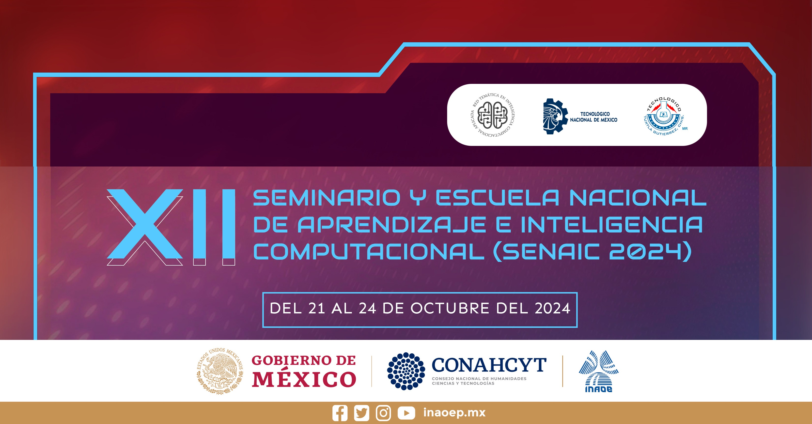

# Aplicación de Transformers en Computación Afectiva ♥️

Este repositorio contiene los ejercicios prácticos a desarrollarse durante el taller de "Aplicación de Transformers en Computación Afectiva" como parte del programa del Seminario y Escuela Nacional de Aprendizaje e Inteligencia Computacional que se realizará del 21 al 24 de octubre del 2024.

## Resumen del Taller

Primero iniciaremos con una introducción a lo que es la computación afectiva enfocándonos al reconocimiento de personalidad por medio del texto. Después abordaremos lo que son los transformers dentro del aprendizaje profundo. En seguida nos meteremos a los principales modelos usando trannsformers como Bert, RoBERTa, BETO y GPT. Para terminar revisando código de aplicaciones como crear un corpus para reconocimiento automático de personalidad, entrenamiento de modelos de aprendizaje usando Transformers para clasificar personalidad y un ejemplo de reconocimiento de personalidad dentro de una aplicación educativa.

## Índice

Abrir índice usando **Google Colab**: 

## Otros sitios de interés:

[SENAIC 2024](https://ccc.inaoep.mx/SENAIC/)

[Google Colab](http://colab.research.google.com)

[Hugging Face Learn](https://huggingface.co/learn)

[TensorFlow Playground](https://playground.tensorflow.org)

[Kaggle Learn](https://www.kaggle.com/learn)